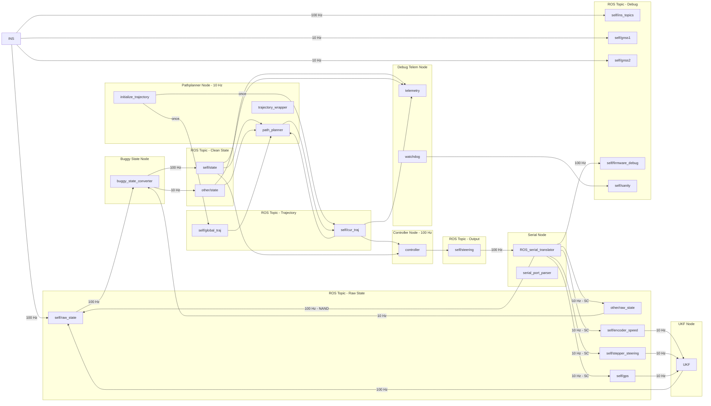

# Code Flow Document
## Scope
The purpose of this file is to outline the desired framework of the auton stack (and the simulator + logging capabilities) of the RD25 software on a file level. This document should be referenced when writing new files for this framework.

The large boxes are ROSNodes. Each individual smaller box is a file. Data within ROSNodes are transferred via function calls, while data between node are transferred via publishers and subscribers.

## Viewing On VSCode
Install `bierne
r.markdown-mermaid` from the extension marketplace to render the charts in VSCode markdown preview.

## Chart!

