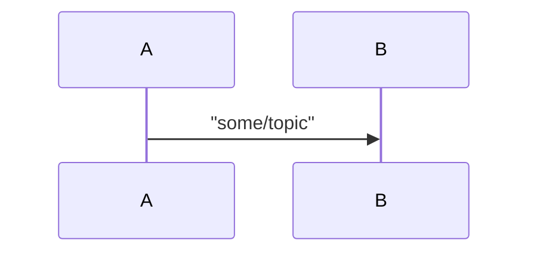
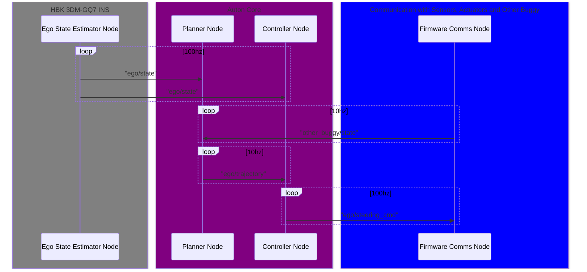

# ROS Node Interaction Document
## Scope
The purpose of this file is to descirbe the architecture of the RD25 stack from a ROS node level. This document should be updated whenever any ROS topics are added, removed or modified.

## Viewing On VSCode
Install `bierner.markdown-mermaid` from the extension marketplace to render the charts in VSCode markdown preview.

## List of topics
| Topic Name | Type                    | is custom message  |
| ---------- | ----------------------- | ------------------ |
| ego/state  | BuggyState              | yes |
| other_buggy/state | BuggyState       | yes |
| ego/trajectory | BuggyTrajectory     | yes |
| ego/steering_cmd | [Float64](https://docs.ros.org/en/melodic/api/std_msgs/html/msg/Float64.html) | no |
| add new topic here | | |

## ROS Nodes Graph
Auton Loop [Sequence Diagram](https://en.wikipedia.org/wiki/Sequence_diagram#:~:text=A%20sequence%20diagram%20shows%2C%20as,order%20in%20which%20they%20occur.)

means A publishes a message of `some/topic` and B receives the message.

